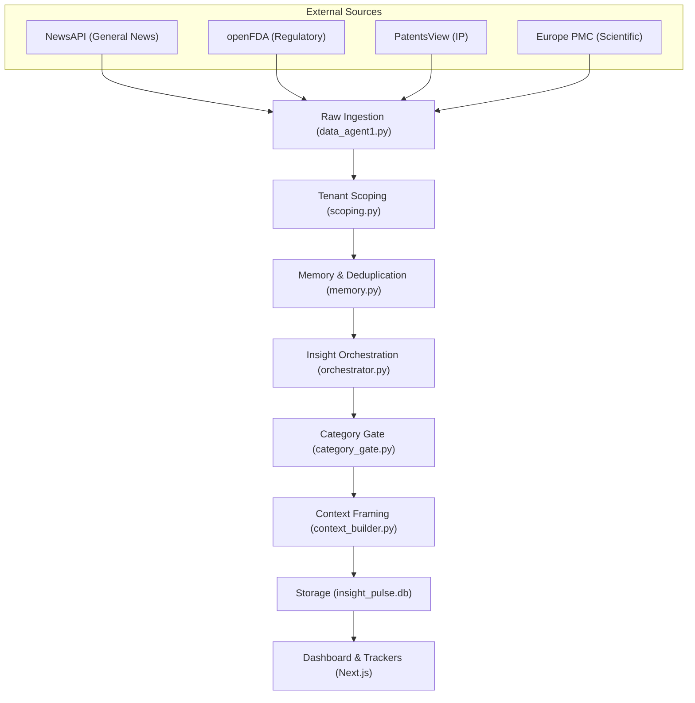

# System Architecture & Technical Flow

**Insight Pulse** is an AI-powered B2B market intelligence system designed to surface synthesized strategic shifts within a partner's competitive landscape. Instead of aggregate data volume, it prioritizes **meaningful change**—detecting severity, velocity, and relevance.

---

## 🏗️ System Architecture

The system follows a multi-stage **agentic pipeline** architecture, moving from raw external data to high-fidelity strategic insights.

---

## ⚡ Detailed Pipeline Flow

### 1. Multi-Source Ingestion (`data_agent1.py`)
- **Action**: Queries external APIs (NewsAPI, FDA, USPTO, Europe PMC) using search terms derived from the tenant's competitors and products.
- **Output**: A normalized list of **Events**. An event is a raw, time-bound, factual occurrence (e.g., a news article headline).

### 2. Tenant Scoping (`scoping.py`)
- **Action**: Filters ingested events against the specific **Tenant Context**.
- **Rule**: Keeps events only if they mention a tracked competitor, a tracked product, or are classified as "Regulatory" (safety net).
- **Goal**: Eliminates noise; ensures the system only identifies relevant **Signals**.

### 3. Memory & Deduplication (`memory.py`)
- **Action**: Generates an MD5 **Fingerprint** for every signal (Headline + Description).
- **Temporal Tracking**: Compares fingerprints against the database.
- **Goal**: Marks repeat signals as "Seen Before" to avoid redundant synthesis and accurately calculate **Velocity** (rate of change).

### 4. Insight Orchestration (`orchestrator.py`)
- **Action**: **LLM Synthesis** (Qwen 2.5 3B / Ollama).
- **Process**: Takes a batch of up to 30 scoped signals and context. It performs "Few-Shot" reasoning to synthesize them into structured **Insights**.
- **Attributes**: Each insight is assigned a **Scope** (Competitor/Product/Market), **Severity** (Low/Med/High), and **Velocity** (New/Stable/Increasing).

### 5. Category Gate (`category_gate.py` & `lenses.py`)
- **Action**: Multi-lens AI classification.
- **Lenses**: Runs the insight through three specialized agents:
    - **Theme**: Industry shifts & regulatory trends.
    - **GTM**: Pricing & commercial execution.
    - **Positioning**: Messaging & differentiation.
- **Best Fit Fallback**: Uses a 0.5 strict threshold for high-confidence categorization, with a **0.1 "Best Fit" fallback** to ensure dashboard breadth for demo purposes.

### 6. Context Strategic Framing (`context_builder.py`)
- **Action**: Generates a professional "Strategic Link" for the UI.
- **Refinement**: Replaces redundant explanations with concise strategic framing (e.g., *"Strategically relevant shift in the competitive environment for [Entity]."*).

---

## 🕒 History & Persistence Layer

The system maintains a local SQLite database (`insight_pulse.db`) to ensure longitudinal continuity and deduplication.

### 🗄️ Core Tables
| Table | Role | Data Stored |
| :--- | :--- | :--- |
| **`events`** | Raw History | Original API JSON responses and ingestion timestamps. |
| **`insights`**| Strategic History | Synthesized intelligence, severity, velocity, and AI explanations. |
| **`fingerprints`** | Memory Layer | MD5 hashes of signals used to identify repeat occurrences. |
| **`context_blocks`**| Relational History | Explicit links between insights and tracked entities (Competitors/Products). |

### 🛠️ How History is Used
1. **Semantic Deduplication**: Before orchestration, every incoming signal is fingerprinted. If a match is found in the `fingerprints` table, it is marked as `_seen_before`, preventing the AI from generating redundant insights.
2. **Velocity Tracking**: The system compares new signals against the frequency of historical fingerprints to determine if a market trend is "Stable," "Increasing," or "New."
3. **Longitudinal Trackers**: The "Competitor" and "Product" tracker pages query historical `insights` to show the strategic evolution of an entity over time.
4. **Context Framing**: Use the `context_blocks` history to map how a single market event affects multiple entities differently based on their historical relationships.

---

## ⚙️ Backend Orchestration (`main.py`)

`main.py` acts as the **Central Nervous System** of Insight Pulse. It is a FastAPI application that handles both data orchestration and API serving.

### � The Intelligence Pipeline (`/api/process`)
When the "Run Pipeline" button is clicked in the UI, `main.py` executes a synchronous 6-stage flow:
1. **Context Loading**: Fetches the tenant's tracked competitors and products from the database.
2. **Ingestion**: Calls `data_agent1` to fetch 90+ multi-source events.
3. **Scoping & Memory**: Passes events through `scoping.py` (relevance filter) and `memory.py` (deduplication/velocity).
4. **Synthesis**: Sends the filtered batch to `orchestrator.py` for LLM insight generation.
5. **Categorization**: Runs each insight through the `category_gate.py` to assign strategic buckets.
6. **Storage**: Commits the final insights and their local strategic contexts to the database.

### 🌐 Key API Endpoints
| Endpoint | Method | Description |
| :--- | :--- | :--- |
| `/api/process` | `POST` | Triggers the full 6-stage intelligence pipeline. |
| `/api/dashboard` | `GET` | Aggregates all insights for the Main Dashboard (Recent/Theme/GTM/Pos). |
| `/api/competitors`| `GET` | Lists all competitors with their specific insight counts and strategic groupings. |
| `/api/products` | `GET` | Lists all products, distinguishing between **Direct** and **Adjacent** market impacts. |

---

## 🎨 UI / UX Philosophy

- **Dashboard**: Prioritizes **Priority over Exhaustiveness**. Insights are sorted by severity/velocity.
- **Trackers**: Provide longitudinal views of specific Competitors or Products.
- **Capitalization & Polish**: Automated title-casing and high-fidelity UI components ensure a "Boardroom Ready" presentation.

## 🛠️ Tech Stack
- **Frontend**: Next.js 14, Tailwind CSS, Lucide React.
- **Backend**: FastAPI (Python 3.10).
- **Intelligence**: LangGraph, Ollama (Qwen 2.5 3B).
- **Storage**: SQLite (insight_pulse.db).
- **API Access**: NewsAPI, openFDA, USPTO PatentsView.
